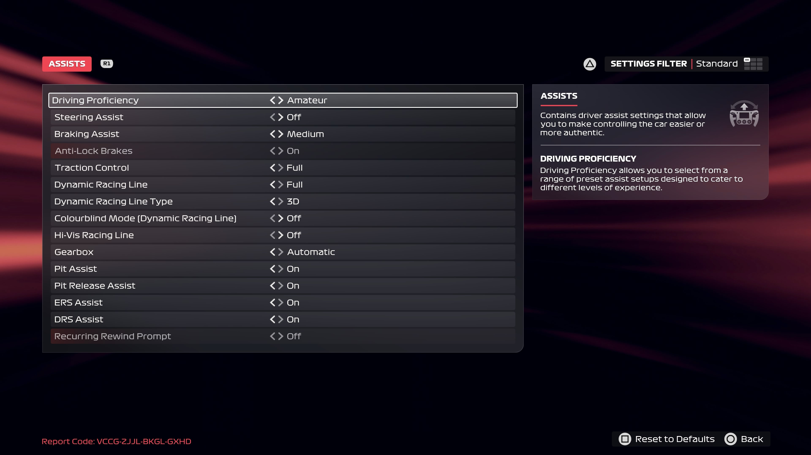

# Assists

1. You are now at the **Grand Prix™ Settings** screen, click on **ASSISTS**
2. Configure the assists:

    <pre>
    Driving Proficiency: **Amateur**
    Steering assist: **Off**
    Braking assist: **Medium**
    Traction Control : **Full**
    Dynamic Racing Line: **Full**
    Dynamic Racing Line Type: **3D**
    Hi-Vis Racing Line: **Off**
    Gearbox: **Automatic**
    Pit Assist: **On**
    Pit Release Assist: **On**
    ERS Assist: **On**
    DRS Assist: **On**
    </pre>

3. Return to the **Grand Prix™ Settings** screen by pressing **O**

