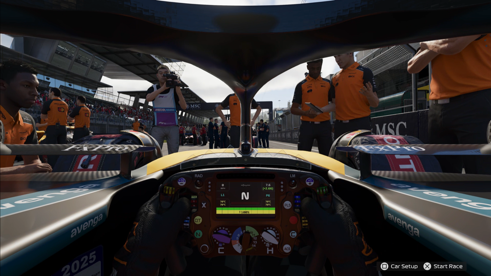

# Go Racing

1. You are now ready to race, select **START EVENT**.
2. You will have a lot of pre-roll, you can skip through all of this by pressing **X**. You should now be at the cockpit view of the car on the track. The car is stopped with people in front of it.

   

3. Press **X** to **Start Race**.
4. At the end of the race, advance to the post race leaderboard. You should see the word **Advance** at the top of the menu stack.
5. Select **Advance**, to start the next Grand Prix.
6. **X** through the pre-roll until you are back in the cockpit view of the car on the track.
7. You are now ready for the next participant.
