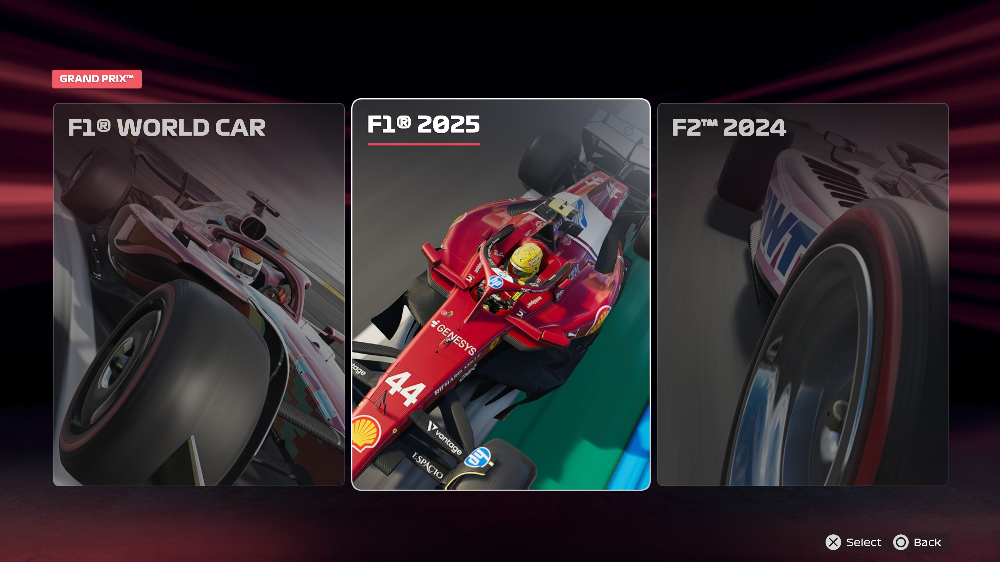
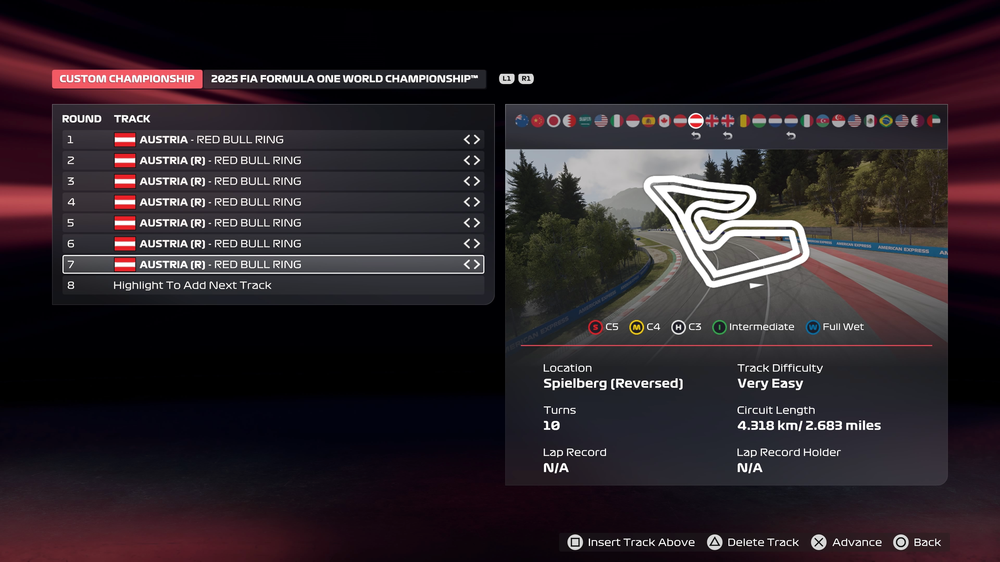

# Game Configuration

1. From the main menu select **F1® WORLD**. If this is the first time playing the game, skip through the tutorials.
2. Click **PLAY**
3. Select **GRAND PRIX™**
4. Select **Start new Grand Prix™**
5. Accept the "**START NEW GRAND PRIX™**" prompt
6. Select the **F1® 2025** option
    
7. Select the desired track. A good suggestion is to use the track for the next Grand Prix or a short track e.g. Austria
8. Select **Highlight To Add Next Track** and add the same track again. Repeat this step until all slots are filled with the same track.
    
9. Select the McLaren team
    
10. Select Lando Norris for the driver
    

<!--[type:video](../assets/screenshots/f1_2023.mp4)-->
