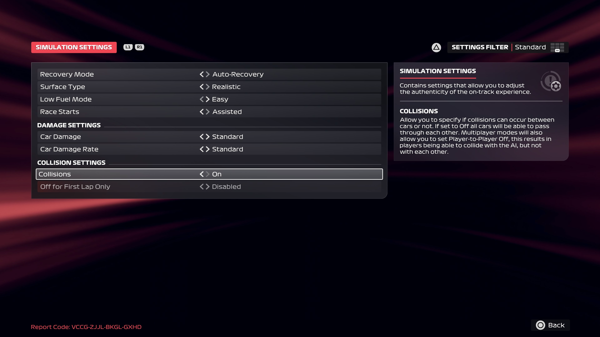

# Simulation Settings

1. Select **SIMULATION SETTINGS**
2. Configure the simulation settings:

    <pre>
    Recovery Mode: **Auto-Recovery**
    Surface Type: **Realistic**
    Low Fuel Mode: **Easy**
    Race Starts: **Assisted**
    Car Damage: **Standard**
    Car Damate Rate: **Standard**
    Collisions: **On**
    Off for First Lap Only: **Off**
    </pre>

3. Return to the **Grand Prix™ Settings** screen

