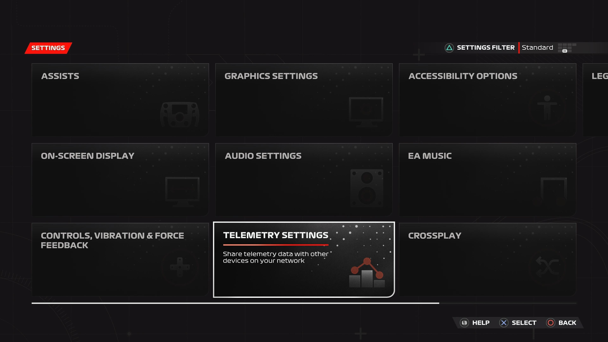

# Telemetry

1. From the main menu select **OPTIONS**

   

2. Select **TELEMETRY**

   

3. Select **Settings**

   

4. Configure the telemetry settings:

    <pre>
    UDP Telemetry: **On**
    UDP Broadcast Mode: **Off**
    UDP IP Address: **IP address of the laptop/EC2 instance running the container**
    UDP Port: **20777**
    UDP Send Rate: **10Hz**
    UDP Format: **2023**
    </pre>

5. Return to the **Grand Prix™ Settings** screen

