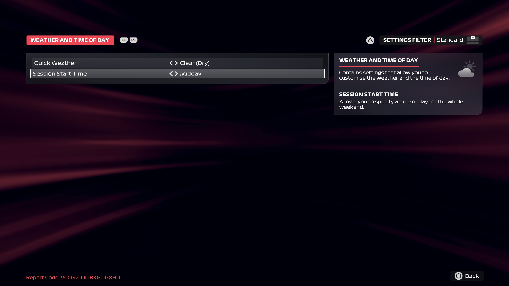

# Weather and Time of Day

1. Select **WEATHER AND TIME OF DAY**
2. Configure the weather and time of day:

    <pre>
    Quick Weather: **Clear (Dry)**
    Session Start Time: **Midday**
    </pre>

3. Return to the **Grand Prix™ Settings** screen

