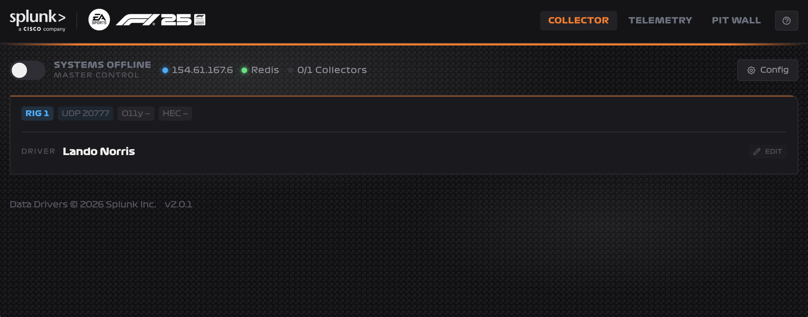

# Controller Configuration

This guide covers the initial configuration of the F1 2025 Data Collector interface.



## Opening the Configuration Panel

Configuration settings are accessed via a slide-over panel. Click the **Config** button (gear icon) in the top-right of the status bar to open it. Press ++escape++ or click outside the panel to close it.

### General

#### Number of Rigs

Choose the number of F1 racing rigs you'll be monitoring during your event. You can configure between 1 and 4 rigs.

#### Event Name

Enter a descriptive name for your event to identify the data stream in Splunk e.g. "Cisco Live", "Snow Testing", "Customer Demo Day"

### Observability Cloud

Toggle the **Observability Cloud** switch to enable this destination. When enabled, the following fields appear:

#### Realm

Select your Splunk Observability Cloud realm from the dropdown.

**Available Realms:**

- `eu0`, `eu1`, `eu2` (Europe)
- `us0`, `us1`, `us2` (United States)
- `au0` (Australia)
- `jp0` (Japan)
- `sg0` (Singapore)

#### Access Token

Enter the Access Token for the Observability Cloud organization where you want to send metrics. If a token is already configured, a green "Token configured" indicator appears and you can leave the field blank to keep the existing token.

### Splunk Enterprise / Cloud

Toggle the **Splunk Enterprise / Cloud** switch to enable this destination. When enabled, the following fields appear:

!!! note "If running a Splunk Show instance, all of the below is pre-configured."

#### HEC URL and Port

Enter your Splunk HTTP Event Collector (HEC) endpoint.

- **Format:** `https://<your-splunk-instance>:8088`
- **Example:** `https://il-0cc8aef679649f2c.splunkcloud.com:8088`

#### HEC Token

Enter your HEC authentication token. If a token is already configured, a green "Token configured" indicator appears and you can leave the field blank to keep the existing token.

### Mode

#### Playback Mode

Toggle the **Playback Mode** switch to enable demo mode using pre-recorded telemetry data.

**When to Use:**

- **Off** (default) - Live events with actual F1 2025 gameplay
- **On** - Demonstrations without racing rigs using pre-recorded data

**Use Cases for Playback Mode:**

- Showcasing Splunk dashboards to customers
- Testing dashboard configurations
- Training sessions without racing equipment
- Demo environments

### Deploying Your Configuration

After configuring all settings:

1. **Review** all fields to ensure accuracy
2. **Click** the **"Deploy Configuration"** button at the bottom of the panel

!!! warning "Deploying stops all running collectors and resets the database"
    Saving a new configuration will stop any running collectors and flush Redis. You will need to restart collectors via Master Control after deploying.

## Configuration Examples

### Example 1: Production Event with Both Platforms

```text
Rigs: 4
Event Name: Cisco Live 2025
Observability Cloud:
  - Realm: us1
  - Access Token: ••••••••
  - Enabled: ✓
Splunk Enterprise:
  - HEC URL: https://prd-splunk.company.com:8088
  - HEC Token: ••••••••
  - Enabled: ✓
Playback Mode: Off
```

### Example 2: Demo Mode with Observability Cloud Only

```text
Rigs: 2
Event Name: Customer Demo
Observability Cloud:
  - Realm: us0
  - Access Token: ••••••••
  - Enabled: ✓
Splunk Enterprise:
  - Enabled: ✗
Playback Mode: On
```

### Example 3: Testing with Splunk Enterprise Only

```text
Rigs: 1
Event Name: Testing Setup
Observability Cloud:
  - Enabled: ✗
Splunk Enterprise:
  - HEC URL: https://localhost:8088
  - HEC Token: ••••••••
  - Enabled: ✓
Playback Mode: Off
```

## Next Steps

After configuring the controller:

1. **[Set up F1 2025 Game Telemetry](telemetry.md)** - Configure UDP output in the game
2. **[Manage Collectors](managing-collectors.md)** - Start data collection
