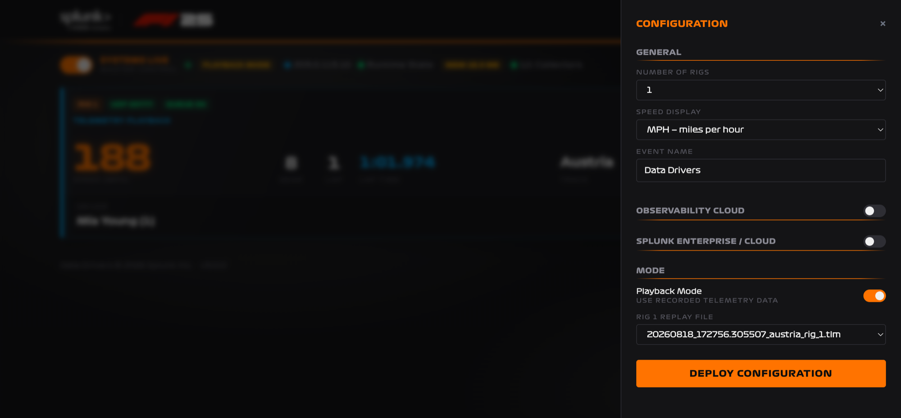
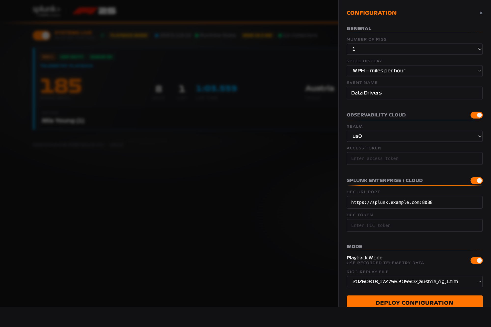

# Collector Configuration

Select **Config** on the Collector page. Changes are written to the mounted configuration file when you select **Deploy Configuration**.

!!! warning "Deploying stops collection"
    **Deploy Configuration** stops any running collectors and clears transient runtime display state. It does not restart collection — turn **Master Control** back on afterwards.

## General

- **Number of Rigs** — enable one to four rigs. One is the default and is recommended unless multiple simulators are actually in use.
- **Speed Display** — show speed in MPH or KPH on the Collector page and Pit Wall. This changes only the display; the raw telemetry fields sent to Splunk are unchanged.
- **Event Name** — a label added to emitted telemetry so an event's data can be identified in Splunk, for example `Data Drivers` or the name of your conference activation.

!!! warning "An event name is required"
    Master Control refuses to start without one. The error reads `Event name is not configured. Set it in Settings before starting collectors.`

The UDP assignments are fixed and predictable:

| Rig | UDP port |
| --- | ---: |
| RIG 1 | 20777 |
| RIG 2 | 20778 |
| RIG 3 | 20779 |
| RIG 4 | 20780 |

## Destinations

Both destinations are optional and independent. Enable each with the toggle next to its heading.

!!! note "Blank token fields keep the stored token"
    Once a token is saved, its field shows a masked placeholder and a **Token configured** indicator. Leaving it blank on a later deploy preserves the stored value; you only need to retype it when the token itself changes.

### Splunk Observability Cloud

Sends a deliberately small allowlist of gauges as metrics through the Splunk ingest API. Full telemetry events remain exclusive to HEC.

1. Enable **Observability Cloud**.
2. Select your **Realm** from the list, for example `us0` or `eu0`.
3. Enter your Splunk Observability Cloud **Access Token**.
4. Select **Deploy Configuration**.
5. Turn **Master Control** back on and confirm the rig cards show **O11y ✓**.

Choose the realm assigned to your Observability organization. The collector builds the ingest URL from it, so no full URL is needed.

### Splunk Enterprise / Cloud

Sends flattened events through HTTP Event Collector.

1. Enable **Splunk Enterprise / Cloud**.
2. Enter the **HEC URL:Port**, for example `https://splunk.example.com:8088`.
3. Enter the **HEC Token**.
4. Select **Deploy Configuration**.
5. Turn **Master Control** back on and confirm the rig cards show **HEC ✓**.

The destination index is not set in the collector. It comes from the HEC token's configuration in Splunk, so ask your Splunk administrator to point the token at the intended index — normally `data_drivers_f1_2025`.

!!! warning "Protect access tokens"
    Treat HEC and Observability tokens as secrets. Do not paste them into chat, screenshots, issue reports, or public configuration examples.

!!! note "HEC certificate verification"
    The collector does not verify TLS certificates when delivering to HEC, which is why a self-signed or IP-addressed endpoint still works. This is retained for compatibility with earlier collector versions. Deploy a trusted HEC certificate where you can, and do not treat the collector as proof that the endpoint is authenticated.

    Certificates *are* verified for Splunk Observability Cloud and for the public-address lookup.

### On Splunk Show

Splunk Show instances arrive with HEC already enabled and configured. Leave the **Splunk Enterprise / Cloud** fields alone and configure only Observability Cloud if you are using it.

Show cannot know your Observability realm or token, so those fields are always yours to fill in.

## Playback Mode

Playback re-sends a recorded `.tlm` file through the normal parsing and delivery pipeline, so it exercises everything except the UDP socket.

1. Enable **Playback Mode** under **Mode**.
2. Select a **Replay File** for each enabled rig.
3. Select **Deploy Configuration**, then turn on **Master Control**.

Every enabled rig must have an existing replay file selected, or startup fails with `Replay file missing for: <rig>`. Replay loops continuously — when a file reaches its end the collector logs `Replay loop #n completed, restarting...` and plays it again.

While playback is enabled, rig cards read **Telemetry playback**, an amber **PLAYBACK MODE** badge appears in the status bar, and the Record control is hidden.

!!! tip "Demo safely"
    Playback is the quickest way to validate destinations and dashboards without occupying a simulator. Check the **PLAYBACK MODE** badge before you expect live UDP packets — a looping replay looks very much like a live session.

To return to live telemetry, disable Playback Mode, deploy, and restart Master Control.

## What starting validates

Turning on Master Control runs these checks in order and refuses to start on the first failure:

1. The configuration file can be read.
2. An event name is set.
3. Every enabled destination passes its health check.
4. At least one rig is configured.
5. In Playback Mode, every rig has an existing replay file.

The failure reason is shown in the UI, which makes Master Control a useful pre-event test on its own.
