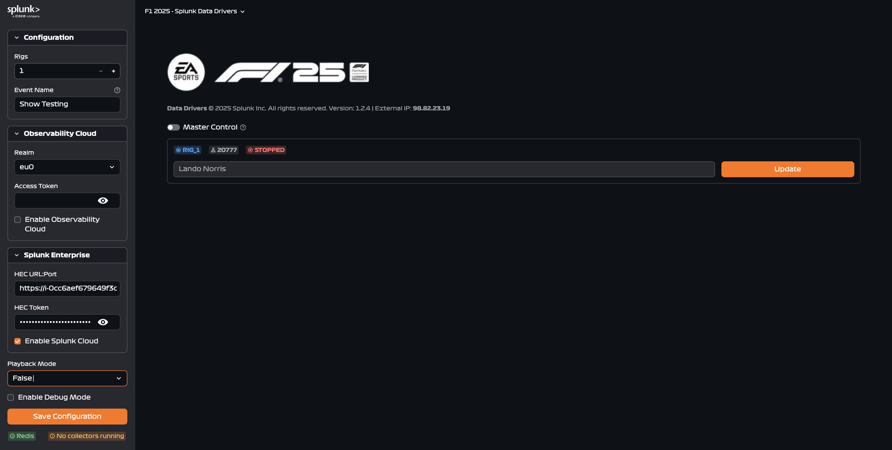

# Controller Configuration

This guide covers the initial configuration of the F1 2025 Data Collector controller interface.



#### Configuration

##### Rigs

Choose the number of F1 racing rigs you'll be monitoring during your event. You can configure between 1 and 4 rigs.

##### Event Name

Enter a descriptive name for your event to identify the data stream in Splunk e.g. "Cisco Live", "Snow Testing", "Customer Demo Day"

#### Observability Cloud Settings

Configure the connection to Splunk Observability Cloud to send real-time metrics.

##### Realm

Select your Splunk Observability Cloud realm from the dropdown.

**Available Realms:**

- `eu0`, `eu1`, `eu2` (Europe)
- `us0`, `us1`, `us2` (United States)
- `au0` (Australia)
- `jp0` (Japan)
- `sg0` (Singapore)

##### Access Token

Enter the Access Token for the Observability Cloud organization where you want to send metrics.

##### Enable Observability Cloud

Check this box to activate data streaming to Observability Cloud.

- **Enabled:** Metrics will stream to Splunk Observability Cloud
- **Disabled:** No data sent to Observability Cloud (use if only sending to Splunk Enterprise)

#### Splunk Enterprise Settings

Configure the connection to Splunk Enterprise or Splunk Cloud.

!!! note "If running a Splunk Show instance, all of the below is pre-configured."
##### HEC URL and Port

Enter your Splunk HTTP Event Collector (HEC) endpoint.

- **Format:** `https://<your-splunk-instance>:8088`
- **Example:** `https://il-0cc8aef679649f2c.splunkcloud.com:8088`

##### HEC Token

Enter your HEC authentication token.

##### Enable Splunk Cloud

Check this box to activate data streaming to Splunk Enterprise/Cloud.

- **Enabled:** Events will stream to Splunk
- **Disabled:** No data sent to Splunk (use if only sending to Observability Cloud)

#### Advanced Options

##### Playback Mode

Playback mode allows demonstrations using pre-recorded data when physical rigs aren't available.

**When to Use:**

- **False** (default) - Live events with actual F1 2025 gameplay
- **True** - Demonstrations without racing rigs using pre-recorded data

**Use Cases for Playback Mode:**

- Showcasing Splunk dashboards to customers
- Testing dashboard configurations
- Training sessions without racing equipment
- Demo environments

#### Debug Mode

Enable additional diagnostic logging for troubleshooting.

#### Saving Your Configuration

After configuring all settings:

1. **Review** all fields to ensure accuracy
2. **Click** the **"Save Configuration"** button at the bottom of the Configuration panel

#### Configuration Examples

##### Example 1: Production Event with Both Platforms

```text
Rigs: 4
Event Name: Cisco Live 2025
Observability Cloud:
  - Realm: us1
  - Access Token: ••••••••
  - Enabled: ✓
Splunk Enterprise:
  - HEC URL: https://prd-splunk.company.com:8088
  - HEC Token: ••••••••
  - Enabled: ✓
Playback Mode: False
Debug Mode: False
```

##### Example 2: Demo Mode with Observability Cloud Only

```text
Rigs: 2
Event Name: Customer Demo
Observability Cloud:
  - Realm: us0
  - Access Token: ••••••••
  - Enabled: ✓
Splunk Enterprise:
  - Enabled: ✗
Playback Mode: True
Debug Mode: False
```

##### Example 3: Testing with Splunk Enterprise Only

```text
Rigs: 1
Event Name: Testing Setup
Observability Cloud:
  - Enabled: ✗
Splunk Enterprise:
  - HEC URL: https://localhost:8088
  - HEC Token: ••••••••
  - Enabled: ✓
Playback Mode: False
Debug Mode: True
```

#### Next Steps

After configuring the controller:

1. **[Set up F1 2025 Game Telemetry](telemetry.md)** - Configure UDP output in the game
2. **[Manage Collectors](managing-collectors.md)** - Start data collection
