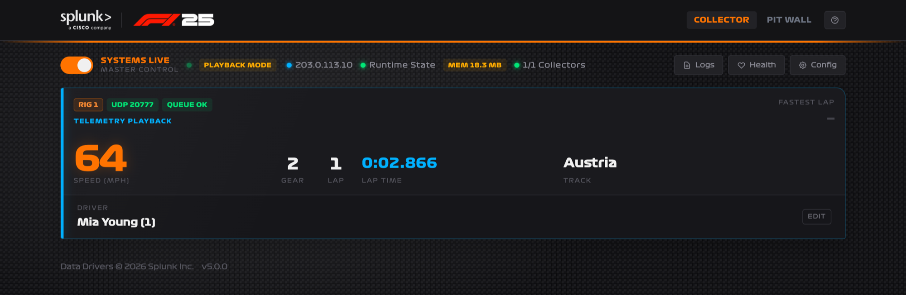

# F1 2025 Data Collector

The F1 2025 Collector receives UDP telemetry from up to four racing rigs and sends it to Splunk Enterprise or Splunk Cloud through HTTP Event Collector (HEC). It can also send a focused set of real-time metrics to Splunk Observability Cloud.

The collector is a single Go application. One process serves the web interface, listens on every rig's UDP port, and delivers to both destinations, so there are no separate listener, queue, or database services to manage.

The default setup uses one rig on UDP port `20777`. Additional rigs can be enabled from the collector when an event needs them.

## Two views

| View | Path | Purpose |
| --- | --- | --- |
| **Collector** | `/` | The operator screen. Master Control, rig cards, driver names, recording, configuration, health, and logs. |
| **Pit Wall** | `/pitwall` | A broadcast-style live telemetry view for a single rig, suitable for a display screen behind the booth. |

## Choose your setup

=== "Splunk Show"

    This is how most events run. Your Show instance already has the collector installed, running, and configured for HEC. Do not replace the HEC URL or token unless your event administrator asks you to.

    1. Open `http://<your-show-host>.splunk.show:81`.
    2. Confirm an **Event Name** is set under **Config → General**.
    3. Configure only your [Splunk Observability Cloud destination](controller-config.md#splunk-observability-cloud), if you are using it.
    4. Select **Deploy Configuration**, then turn on **Master Control**.
    5. Copy the collector's public address from the header into F1 25 and use UDP port `20777` for the first rig.
    6. Enter the driver's name on the rig card before their race.

=== "Run locally"

    Run the collector with Docker on macOS or Linux, then configure your own HEC and/or Observability destination.

    1. Follow [Docker Setup](docker-setup.md).
    2. Open `http://localhost:81`.
    3. Configure [an event name and your destinations](controller-config.md).
    4. Configure [F1 25 UDP telemetry](telemetry.md).
    5. Enter the driver's name on the rig card.

## Event workflow

1. Open **Config**, set the number of rigs and an **Event Name**, and enable the destinations you need.
2. Select **Deploy Configuration**. This writes the configuration file and stops any running collectors.
3. Turn on **Master Control**. The collector validates every enabled destination before it starts; a failed check prevents startup and shows the reason.
4. Configure each game to use the collector's address and that rig's UDP port.
5. Enter the driver's name on the correct rig card before their race.
6. Run the event. When F1 25 sends **Final Classification**, the collector marks the rig **Race complete** and emits a `SessionCompleted` summary containing the session's fastest lap.
7. If Final Classification never arrives, the collector falls back to **Session Ended** after a 60-second grace period and publishes the summary from cached data.

!!! tip "Test before guests arrive"
    Run one complete short race, including the results screen, before the event. This checks UDP reception, destination delivery, and automatic session completion in one pass.

## Next steps

- [Understand the Collector page](configuration.md)
- [Configure the collector](controller-config.md)
- [Configure F1 25 telemetry](telemetry.md)
- [Run an event](managing-collectors.md)
- [Use the Pit Wall](pit-wall.md)
- [Monitor collector health](monitoring.md)
- [View your data in dashboards](dashboards.md)
