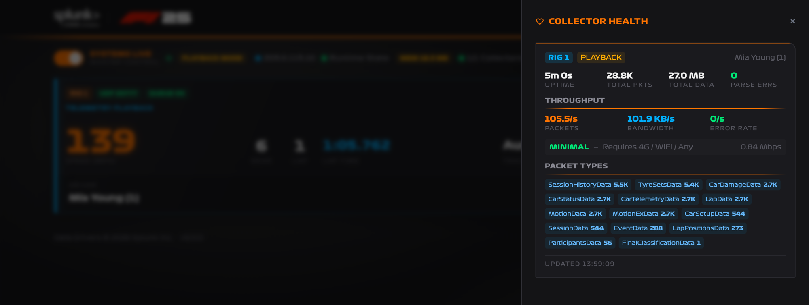
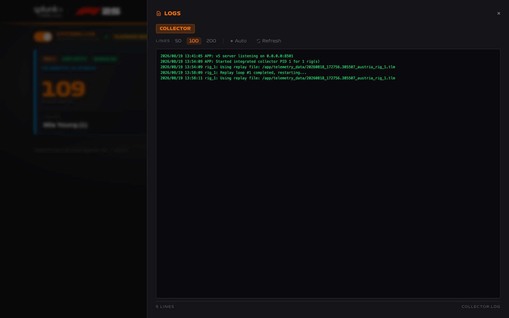

# Monitoring and Troubleshooting

The collector separates UDP ingest from destination delivery. A healthy game connection does not prove HEC or Observability is healthy, so check both sides.

## Pre-event checklist

- The collector container reports `healthy`.
- **Master Control** reads **SYSTEMS LIVE** and the status bar shows **n/n Collectors**.
- **Runtime State** is green.
- Every enabled destination shows **✓** on the rig cards.
- A short practice session moves each card to **Telemetry live** with real speed, lap, and track values.
- The queue pill reads **QUEUE OK** under load.
- Every active rig has the correct driver name.
- A complete short race ends with the card showing **Race complete**.

!!! tip "Master Control is the fastest pre-event test"
    It validates the config file, the event name, every enabled destination, the rig list, and — in Playback Mode — the replay files, and reports the first failure. Toggling it off and on is a full pre-flight check.

## Collector Health

Open **Health** to inspect UDP reception and parser activity per rig.



| Metric | Meaning |
| --- | --- |
| **Uptime** | How long this rig's collector has been running |
| **Total Pkts** / **Total Data** | Cumulative UDP packets and bytes since that collector started |
| **Parse Errs** | Packets that could not be decoded |
| **Packets** | Incoming UDP packet rate over the last 10 seconds |
| **Bandwidth** / **Error Rate** | Current throughput and decode failure rate |
| **Packet Types** | Cumulative decoded counts grouped by F1 packet type |

This panel is the best place to answer "is the game reaching this UDP port?". It is entirely separate from the outbound queue pill — health counts packets coming *in*, the queue pill counts requests going *out*.

With two or more collectors running, a **Combined** summary appears above the per-rig panels.

## Logs

Open **Logs** for the collector log. It covers application lifecycle, endpoint errors, retry failures, and 10-second outbound request statistics.



Choose 50, 100, or 200 lines, enable **Auto** to refresh every five seconds, or select **Refresh**. Local Docker users can also follow the container log:

```bash
docker logs -f f1-2025
```

Look for the first concrete endpoint or parsing error rather than repeatedly restarting the collector.

!!! note "`Requests/10s` is not the packet rate"
    That log line measures outbound sink requests, so it will not match the incoming UDP packet rate shown in Health.

The log file is `/app/collector.log`, rotated at 10 MB with three backups. The collector does not send its own log to HEC; use your container platform's logging integration if collector logs must be indexed in Splunk.

## Common problems

### Master Control will not turn on

The collector reports the first failed check. The usual causes:

| Message | Fix |
| --- | --- |
| `Event name is not configured.` | Set **Event Name** under **Config → General** and deploy. |
| An endpoint error | A destination you enabled failed its health check. Correct the realm, URL, or token. |
| `No rigs configured.` | Set the rig count under **Config → General**. |
| `Replay file missing for: <rig>` | Select an existing replay file for every rig, or disable Playback Mode. |

### No UDP packets

1. Confirm **UDP Telemetry** is On in F1 25.
2. Enter the collector address exactly as shown in the status bar; use the LAN address for a LAN-only deployment.
3. Confirm RIG 1 uses `20777`; additional rigs use `20778`–`20780`.
4. Confirm UDP Broadcast Mode is Off.
5. Check the host firewall, Docker port publishing, and cloud security group.
6. Confirm the rig can route to the collector address.

The public-address lookup can fail on a network that intercepts TLS. The collector still runs when it does; the address badge is simply absent, and you can use the LAN or known public address directly.

### Packets arrive but no events are delivered

Confirm the destination is actually enabled and healthy:

- the destination toggle is on in **Config**;
- the rig card pill shows **HEC ✓** or **O11y ✓**;
- the token and URL or realm are correct; and
- the HEC token points at an index that exists and accepts it.

Then check the Logs panel for the first delivery error.

### The queue pill shows DROP

The collector is producing outbound requests faster than a destination accepts them, or that destination is failing. Open **Logs**, correct the endpoint or network problem, and watch the pill return to **QUEUE OK**.

Because the collector holds outbound requests in memory rather than on disk, events rejected for capacity are not retried from a spool. Fix a failing destination promptly rather than letting it run degraded.

### A card stays on "Awaiting telemetry"

The collector is running but no packets have arrived recently. Check Health for that rig's packet count. If it is not increasing, the problem is on the UDP side — see [No UDP packets](#no-udp-packets).

### A card stays on "Race complete"

That rig received Final Classification and is showing the finished session. Enter the next driver's name to clear it.

### Observability is off on Splunk Show

Show configures HEC for you, but cannot know your Observability realm or token. Set them under **Config → Destinations**, deploy, restart Master Control, and confirm the cards show **O11y ✓**.

## During an event

Keep the Collector page visible to the operator. Check Health when a card stops updating; avoid restarting a healthy collector just because a car is stationary in the game.
