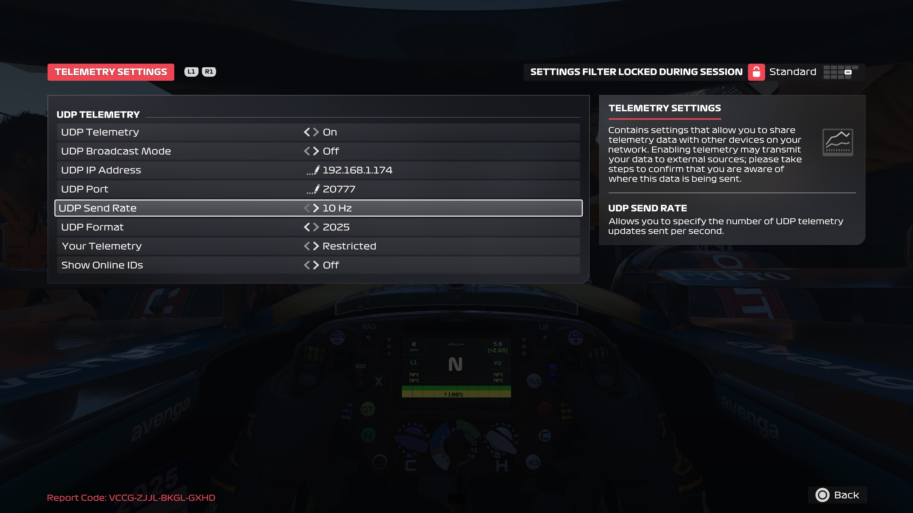

# F1 2025 Telemetry Configuration

Configure the F1 2025 game on each racing rig to send UDP telemetry data to the collector.

## Finding the IP Address

The IP address you need is displayed under the F1 25 logo of the collector controller interface. The **External IP address** is displayed there (e.g., `98.82.23.19`). Use this IP address in the game's telemetry settings.

**IP Address to Use:**

- **Splunk Show:** External IP shown in the controller (e.g., `98.82.23.19`)
- **Self-Hosted (Laptop):** IP address of your laptop on the network
- **Self-Hosted (Cloud):** External IP address of your EC2/cloud instance shown in the controller

## Configuring F1 2025 Game

On each racing rig PC:

1. **Launch F1 2025**
2. Navigate to **Game Options** → **Settings** → **Telemetry Settings**
3. Configure the following settings:

| Setting | Value |
|---------|-------|
| UDP Telemetry | **On** |
| UDP Broadcast Mode | **Off** |
| UDP IP Address | **External IP from controller** (see above) |
| UDP Port | **20777** (first rig) |
| UDP Send Rate | **10Hz** |
| UDP Format | **2025** |
| Your Telemetry | **Restricted** |
| Show Online IDs | **Off** |

## Multiple Rigs Configuration

If you're running multiple racing rigs, each rig needs a unique UDP port.

| Rig | UDP Port | IP Address |
|-----|----------|------------|
| Rig 1 | 20777 | Same External IP for all rigs |
| Rig 2 | 20778 | Same External IP for all rigs |
| Rig 3 | 20779 | Same External IP for all rigs |
| Rig 4 | 20780 | Same External IP for all rigs |

!!! important "Same IP, Different Ports"
    All rigs use the **same IP address** (the External IP from the controller) but **different UDP ports**. The controller automatically differentiates between rigs based on the port number.

## Testing Your Configuration

After configuring the game telemetry:

- **Start a Practice Session** in F1 2025
- **Check the Controller Interface:**
    - UDP port should turn **green**
    - Real-time data should appear (speed, lap, track) in the Collector UI
- **If Port is Red:**
    - Verify IP address is correct
    - Check UDP port number
    - Test network connectivity (ping the IP from rig PC)
    - Ensure F1 2025 telemetry is enabled

## Next Steps

After configuring game telemetry:

1. **[Manage Collectors](managing-collectors.md)** - Start data collection
2. **[View Dashboards](dashboards.md)** - Access your data in Splunk
