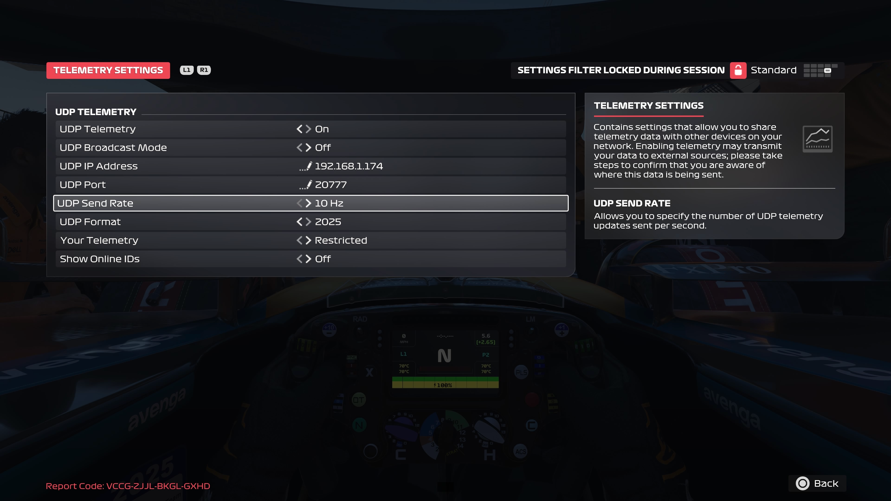

# F1 2025 Telemetry Configuration

Configure every racing rig to send F1 25 UDP telemetry to the collector.

## Find the collector address

The collector's public IP address is shown in the status bar of the Collector page, next to a blue indicator.

- **Splunk Show or cloud deployment:** use the public address shown in the status bar.
- **Local Docker:** use the Docker host's LAN address, not `localhost`, because the game runs on another computer.
- **Same computer:** `127.0.0.1` can be used only when F1 25 and the collector run on the same machine.

## Configure F1 25

On the racing rig:

1. Launch F1 25.
2. Open **Game Options → Settings → Telemetry Settings**.
3. Configure:

| Setting | Value |
| --- | --- |
| UDP Telemetry | **On** |
| UDP Broadcast Mode | **Off** |
| UDP IP Address | The collector address |
| UDP Port | `20777` for RIG 1 |
| UDP Send Rate | **10Hz** |
| UDP Format | **2025** |
| Your Telemetry | **Restricted** |
| Show Online IDs | **Off** |

## Multiple rigs

All rigs use the same collector address but a unique UDP port:

| Rig | UDP port |
| --- | ---: |
| RIG 1 | 20777 |
| RIG 2 | 20778 |
| RIG 3 | 20779 |
| RIG 4 | 20780 |

Enable the required rig count under **Config → General** before testing, and deploy. For self-hosted Docker, publish the same UDP ports on the container.

## Test the connection

1. Turn on **Master Control** and confirm it reads **SYSTEMS LIVE**.
2. Enter a driver name on the rig card.
3. Start a Practice session in the game.
4. Confirm the card moves to **Telemetry live** and shows speed, gear, lap, and track.
5. Open **Health** and confirm the rig's packet count increases.
6. Confirm the card's destination pills show **✓**.

!!! tip "Use the displayed address"
    Cloud public addresses can change when an instance is replaced. Read the address from the status bar during event setup rather than copying it from an old runbook.

## If data does not appear

- Recheck the IP address and assigned port.
- Confirm the collector host firewall allows inbound UDP.
- Confirm the Docker or cloud port mapping exists.
- Make sure UDP Broadcast Mode is Off.
- Confirm Master Control is on and the rig count covers this rig.
- Use [Monitoring and Troubleshooting](monitoring.md) to separate UDP and destination problems.
