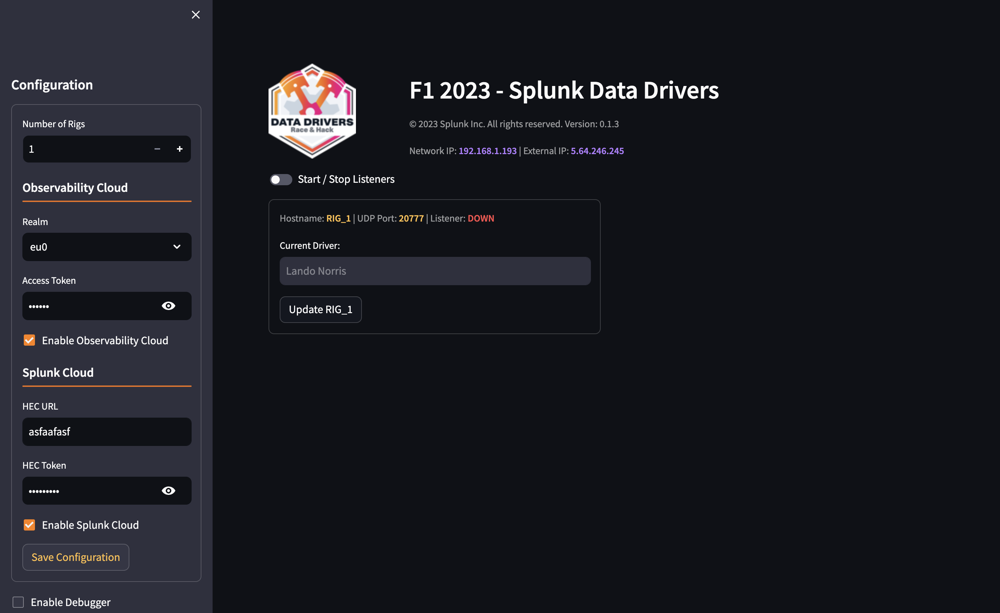

# F1 2023 Web Interface

To access the UI open a browser and navigate to `http://<ip_address>:8501` where `<ip_address>` is the IP address of the laptop/EC2 instance running the container.

Here you can configure where the game data is going to be sent.

